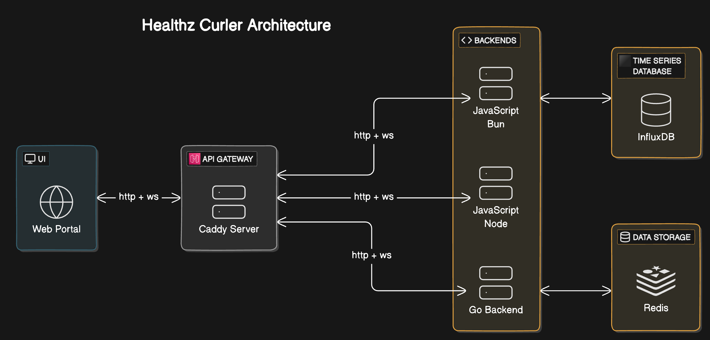

# Healthz Curler

Healthz Curler is a __polyglot__ web application designed to perform periodic health checks on various services. It uniquely integrates multiple backends written in different programming languages and runtimes, showcasing a __polyglot__ approach to backend development.

This application leverages the power of webSockets for real-time updates, all reverse proxied by Caddy serving as an API gateway. The user interface allows for seamless selection and interaction with the desired backend, making Healthz Curler a versatile tool for monitoring the health of web services.

## Current backend implementations

- JavaScript (Bun runtime)
- JavaScript (Node runtime)
- Go

## Features

- __Polyglot Backends__: Utilizes multiple programming languages and runtimes for backend development, demonstrating flexibility and scalability.
- __Real-Time Updates__: Implements WebSocket communication in each backend for real-time updates on health check statuses.
- __Configurable Health Checks__: Users can configure health checks with various parameters such as interval, method, expected response code, and more.
- __User-Friendly Interface__: Provides a simple and intuitive UI for configuring and monitoring health checks.

## Architecture Overview



## Project Structure

```text
/healthz-curler
|-- /bun            # JS - Bun runtime implementation
|-- /node           # JS - Node runtime implementation
|-- /go             # Go runtime implementation
|-- /ui             # UI components and logic
|   |-- /src
|   |-- /public
|-- /gateway      
|   |-- /caddy      # Caddy configuration for reverse proxy
|-- /config         # Docker Compose configuration
|   |-- docker-compose.yml
```
